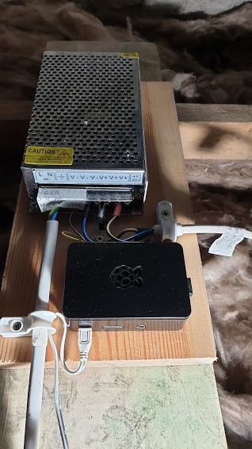
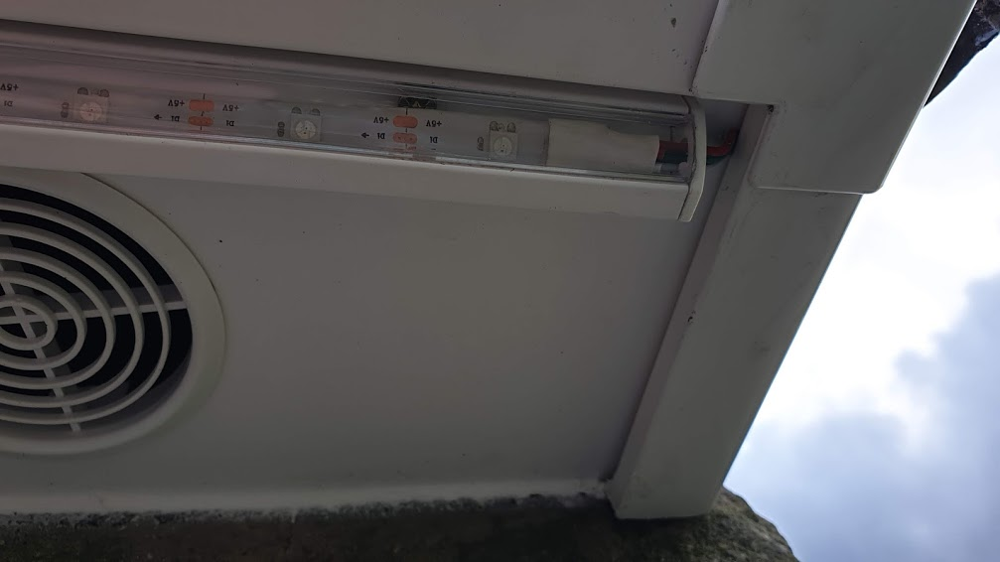
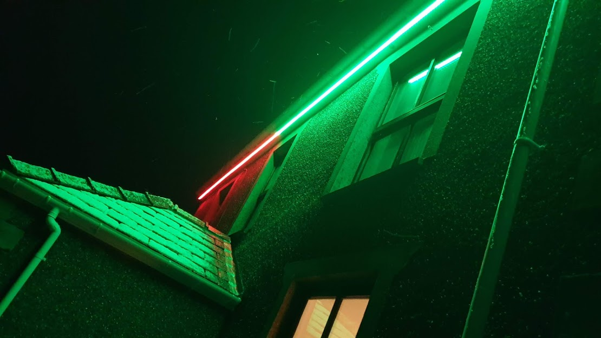

# Raspberry Pi LED Strip Controller

Just a bit of fun this one, building upon a combination of very useful tutorials provided by others. Hopefully it will help people get up and running quickly.

## Features
- Drive an LED strip from a Raspberry Pi (Version 1.0 Model B+ used for this project).
- Variable LED strip length (329 LEDs over 11 meters used for this project).
- Supports programmable sequences using the NeoPixels Python library.
- Powered by a mains Smart Plug allowing remote power control and a scheduled timer.
- This project will hopefully allow me to avoid climbing a ladder in the winter every year to hook up temporary Christmas fairy lights.

## Prerequisites
Hardware:
- Raspberry Pi
- WS2812B 5V LED strip (purchased in various lengths and connected end to end)
- 5V DC Power Supply
- Optional (but best practice)
	- 1000μF Capacitor 6.3V or higher
	- 300 to 500 Ohm resistor

Software:
- Python3
- NeoPixels

## Getting Started

**Disclaimer: The power supply used in this project required mains voltage wiring which is beyond the scope of this tutorial. Working at mains voltage can be extremely dangerous. There are power supplies available that only require wiring for the low voltage (5V) circuit that may be more suitable. Seek guidance from a competent electrician.**

### Hardware components


The circuit diagram above (from [this tutorial](https://tutorials-raspberrypi.com/connect-control-raspberry-pi-ws2812-rgb-led-strips/)) shows the basic set up.
 - The LED strip was powered by connecting a 5V external power supply to the +5V and GND lines on the strip.
 - PIN 06 (Ground) on the Raspberry Pi GPIO header was connected to the GND (Ground) line on the strip.
 - PIN 12 (GPIO18) on the Raspberry Pi GPIO header was connected to the Din (Data in) line on the strip.

Adafruit provide a [page on best practices](https://learn.adafruit.com/adafruit-neopixel-uberguide/best-practices) for wiring LED strips, they recommend:
 - A 1000μF capacitor across the power supply terminals to buffer sudden changes in current drawn by the strip.
 - A 300 to 500 Ohm resistor on the data line of the LED strip. This should be placed at the end of the wire closest to the LED strip to help maintain signal integrity.
 - Try to minimise the distance between the Raspberry Pi and the LED strip, so the signal is clear. A shielded twisted pair (Cat 6) cable will offer a good level of protection from interference.

The longer the LED strip the more current will be drawn. The power supply needs to be capable of providing enough current. WS2812B LEDs draw approximately 1.5 amps/meter when they are set to full brightness so for 11m a power supply capable of providing at least 16.5A was required [see this page for more information](https://www.pololu.com/product/2547).
- The supply used was rated at 40A.
- Additionally, the cable connecting the power supply to the LED strip must be [rated to deliver the required current](https://www.engineeringtoolbox.com/wire-gauges-d_419.html).

### Software components

The [rpi_ws281x](https://github.com/jgarff/rpi_ws281x) library wraps [Adafruit's NeoPixel library](https://github.com/adafruit/Adafruit_NeoPixel), providing an easy way to control LED strips on a Raspberry Pi with Python.

The required software libraries were installed on the Raspberry Pi using instructions in the excerpt below provided by [this tutorial](https://tutorials-raspberrypi.com/connect-control-raspberry-pi-ws2812-rgb-led-strips/).

<details>
<summary>Install software libraries - click to expand.</summary>
<p>

1. The package sources are updated:

```
sudo apt-get update
```

2. We install the required packages (confirm with Y):

```
sudo apt-get install gcc make build-essential python-dev git scons swig
```

3. The audio output must be deactivated. For this we edit the file

```
sudo nano /etc/modprobe.d/snd-blacklist.conf
```

Here we add the following line:

```
blacklist snd_bcm2835
```

Then the file is saved by pressing CTRL + O and CTRL + X closes the editor.

4. We also need to edit the configuration file:

```
sudo nano /boot/config.txt
```

Below are lines with the following content (with Ctrl + W you can search):

```
# Enable audio (loads snd_bcm2835)
dtparam=audio=on
```

This bottom line is commented out with a hashtag # at the beginning of the line:

```
#dtparam=audio=on
```

5. We restart the system

```
sudo reboot
```

Now we can download the library.

```
git clone https://github.com/jgarff/rpi_ws281x
```

In this directory are some C files. In order to use them in Python, we need to compile them:

```
cd rpi_ws281x/
sudo scons
cd python
```

Here we carry out the installation:

```
sudo python3 setup.py build 
sudo python3 setup.py install 
sudo pip3 install adafruit-circuitpython-neopixel
```
</p>
</details>

A test script called **strandtest.py** is included with the rpi_ws281x library.

<details>
<summary>Configure the test script - click to expand.</summary>
<p>

The Raspberry Pi's PWM pin and the number of connected LEDs were configured by editing the script:

```
sudo nano examples/strandtest.py
```

The LED_COUNT and LED_PIN constants were updated as follows (CTRL + O and CTRL + X to save and close the editor):

```
LED_COUNT      = 329 # Number of LED pixels.
LED_PIN        = 18  # GPIO pin connected to the pixels (18 uses PWM!).
```

</p>
</details>

With the software configured and the hardware connected, the test script was executed to confirm that the setup worked. The LEDs lit up and started running through their sequence:

```
sudo python3 examples/strandtest.py
```

Sequences were then written using the rpi_ws281x library.

<details>
<summary>Clone sequences  - click to expand.</summary>
<p>

```
cd /home/pi/led-strip-driver-python/rpi_ws281x/python
git clone https://github.com/inventive-technology/rpi-led-strip.git
```

Execute the sequences, for example:

```
sudo python3 rpi-led-strip/scan.py
```

</p>
</details>


Finally, the script was installed as a service so that it started automatically on boot. By connecting the whole system to a mains Smart Plug it could was powered on/off using Alexa voice commands and scheduled to come on at the same time as the Christmas tree lights every day.

<details>
<summary>Install as a service - click to expand.</summary>
<p>
A shell script was created to wrap the startup command, this allows changes to the script currently in use without having to reinstall the service:

```
sudo nano /home/pi/led-strip-driver-python/rpi_ws281x/python/led-strip-driver-python.sh

```

Add contents:

```
#!/bin/bash
python3 rpi-led-strip/scan.py
```

Create a service file:

```
sudo nano /lib/systemd/system/led-strip-driver-python.service

```

Add configuration:

```
[Unit]
Description=led-strip-driver-python
After=multi-user.target

[Service]
WorkingDirectory=/home/pi/led-strip-driver-python/rpi_ws281x/python
ExecStart=/home/pi/led-strip-driver-python/rpi_ws281x/python/led-strip-driver-python.sh


[Install]
WantedBy=multi-user.target
```

Install the service:

```
sudo systemctl daemon-reload
sudo systemctl enable led-strip-driver-python.service
sudo systemctl start led-strip-driver-python.service
```

</p>
</details>

### All finished!

Components assembled:



 - The LED strips used were IP65 rated and have been mounted in IP65 aluminium profiles to provide further protection from the weather.



### Contributing
This project was a bit of fun for Christmas. If you have any feedback/ideas [open an issue](https://github.com/inventive-technology/rpi-led-strip/issues/new) and tell me what you think.

### References/Related Projects
- https://tutorials-raspberrypi.com/connect-control-raspberry-pi-ws2812-rgb-led-strips
- https://www.thegeekpub.com/16187/controlling-ws2812b-leds-with-a-raspberry-pi
- https://learn.adafruit.com/adafruit-neopixel-uberguide/best-practices
- https://www.engineeringtoolbox.com/wire-gauges-d_419.html
- https://www.pololu.com/product/2547
- https://github.com/jgarff/rpi_ws281x
- https://github.com/adafruit/Adafruit_NeoPixel